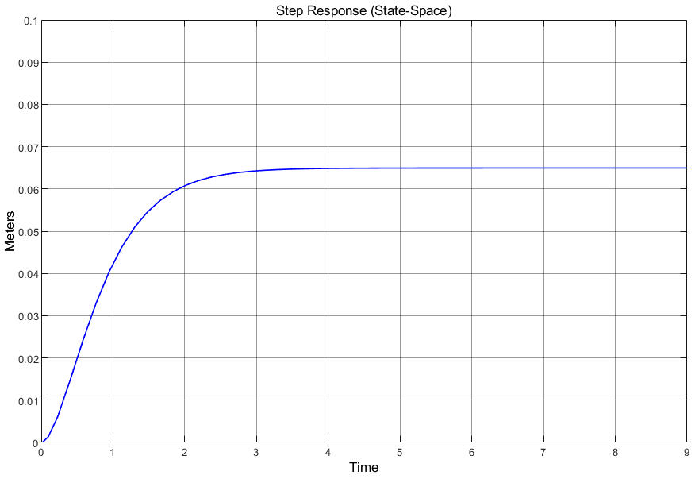

  <h1>PneumaticLab 🔬</h1>
  <p><em>Control Air. Master Machines.</em></p>
  <p>An interactive educational dashboard for simulating pneumatic physics and control theory.</p>

  <p>
    
    
    
    
  </p>
</div>

<hr>

## 🚀 Overview

**PneumaticLab** is a modern, virtual prototype laboratory designed to bridge the gap between complex engineering mathematics and intuitive understanding. It transforms dry control theory (like Proportional-Integral-Derivative controllers and State Space models) into a fun, interactive, visual experience accessible to absolute beginners.

Whether you are trying to understand how factory robots move so smoothly or how heavy machinery lifts tons of weight, this dashboard breaks it down using interactive sliders, real-time graphing, and zero-knowledge-required explanations.

## ✨ Key Features

- **Interactive Physics Simulator**: Adjust physical properties like Mass (M), Damping (D), Spring coefficient (C), and Air Pressure (P) in real-time.
- **Live Control Feedback**: Toggle a virtual **PID Controller** on and off to see how computer algorithms fix physical overshoot.
- **Control Theory Decoded**: Clear, visual comparisons between classic PID control (the "speedometer" approach) and modern State Space control (the "dashboard" approach).
- **Industry Software Mapping**: Direct comparisons to industry-standard tools like Simulink and Simscape.
- **Sleek UI/UX**: A highly responsive, professional "Engineering Dashboard" aesthetic.

---

## 📸 Sneak Peek

| Real-Time Simulation | Visual Explanations |
| :---: | :---: |
|  |  |

*(Note: These are sample images from the educational material inside the app!)*

---

## 🛠️ Local Setup & Installation

Want to run this laboratory on your own machine? It takes less than 2 minutes!

1. **Clone the repository**:
   ```bash
   git clone https://github.com/your-username/Virtual_Pneumatic_System.git
   cd Virtual_Pneumatic_System
   ```

2. **Create a virtual environment (Recommended)**:
   ```bash
   python -m venv venv
   # On Windows:
   .\venv\Scripts\activate
   # On Mac/Linux:
   source venv/bin/activate
   ```

3. **Install the dependencies**:
   ```bash
   pip install -r requirements.txt
   ```

4. **Run the server**:
   ```bash
   python app.py
   ```

5. **Open the lab**:
   Open your web browser and navigate to `http://127.0.0.1:5000`

---

## 🌐 Deploying to the Web (For Free)

This project is fully pre-configured to be deployed for free on **Render.com** (thanks to the included `Procfile` and `requirements.txt`).

1. Push this repository to your GitHub account.
2. Log in to [Render.com](https://render.com).
3. Click **New** -> **Web Service**.
4. Connect your GitHub repository.
5. Render will automatically detect the settings and launch your app. Your website will be live at `https://your-app-name.onrender.com`!

---

## 🤝 Contributing
Contributions, issues, and feature requests are welcome! Feel free to check the [issues page](https://github.com/your-username/Virtual_Pneumatic_System/issues).

<div align="center">
  <br>
  <i>Designed for 100% understanding. Built with ❤️.</i>
</div>
